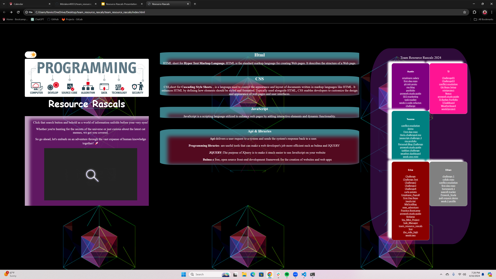

# scratch
random

## I enjoy JavaScript because it utilizes both Functional programming and Object-oriented programming.

## TEAM Resource Rascals

- Erica CSS  
- Yvonne - HTML
- Austin - JS

# Ideas

Use "Google Search" for what we've learned in class from HTML/CSS/JS/JQUERY

- Click on link will take us to resources to look at for (CSS, HTML, ETC.)
- Multi Resourse links that are clickable

- editing our website 

## Resourses

